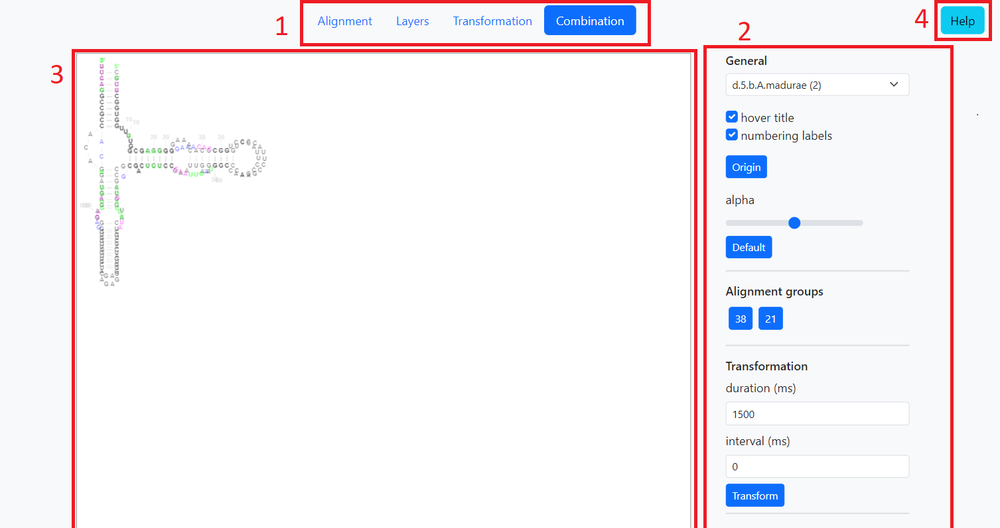
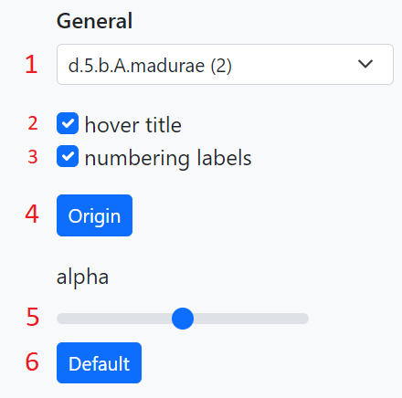
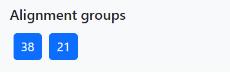
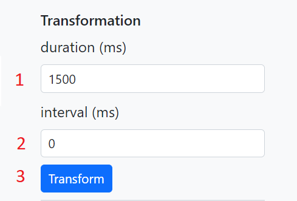
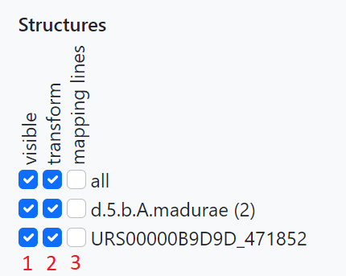

# Demo help

This is demonstration of a Typescript library for visualizing multiple RNA
secondary structures using template-based generation of radial diagram for
comparing structures between each other by mapping diagrams via template
diagram.

## Overview

 1. [Navigation panel](#navigation-panel) - to switch content of [Control
    panel](#control-panel).
 2. [Control panel](#control-panel) - through this panel you can play with
    methods for visualizing and comparing RNA secondary structures seen on the
    [Canvas](#canvas) as well as switching between structures. It's content can
    be changed via [Navigation panel](#navigation-panel).
 3. [Canvas](#canvas) - displaying RNA secondary structures and mediates some
    interactions with it.
 4. Help - shows a dialog with this help text.

## Canvas

Canvas is displaying structures as a radial diagrams. You can zoom or pan
canvas as you wish and in some [situations](#navigation-panel) by clicking on a
nucleotide of a template structure or near it on the canvas all structures that
has nucleotide that is mapped to the template nucleotide are aligned to that
nucleotide.

## Control panel

through this panel you can play with methods for visualizing and comparing RNA
secondary structures seen on the [Canvas](#canvas) as well as switching between
structures. It's content can be changed via [Navigation
panel](#navigation-panel). It's divided into four segments - general, alignment
groups, transformation, structures.

### General

 1. Switch between sets of a structures.
 2. turn on/off hover label which is displayed when you hover with mouse over a
    nucleotide on the [canvas](#canvas).
 3. Hide labels showing index of a nucleotide.
 4. Reset position of structures to origin (left upper corner).
 5. Change alpha for the [canvas](#canvas).
 6. Set alpha for the [canvas](#canvas) to default value, which is proportional
    to number of displayed structures.

  

### Alignment groups

In alignment groups segment you can align structures by clicking on one of the
buttons. Each button has number that represents potential number of aligned
nucleotides so button with bigger number could align more nucleotides than
button with smaller number but it's not a rule.

  

### Transformation

Transformation segment can be used for animated transformation of structures to
and from template structure. It is divided into two parts. First part is hiding
nucleotides which are not mapped to any template nucleotide. Second part is
moving all other nucleotides to the position of their template nucleotides.
 1. Duration of the animations second part in miliseconds
 2. Delay between hiding each nucleotide in the animations first part.
 3. Starts animated transformation.

  

### Structures

 1. Shows/hides structure.
 2. If checked, the structure won't be transformed when clicking on
    [transform](#transformation) button.
 3. Shows/hides mapping lines, which connects structure nucleotides with
    nucleotides in template structure to which they are mapped.

  

## Navigation panel

Changes content of [control panel](#control-panel). Navigation panel has four
options - Alignment, Layers, Transformation and Combination. Alignment, Layers
and Transformation isolates some methods for visualizing and comparing RNA
secondary structures. The fourth option, Combination, is for working with all
methods at once to explore the full potentional of the library.

On the control panel you can always find [general segment](#general) where you
for example switch between set of structures. Besides general segment control
panel always contains switch to turn on/off mapping lines for each structure at
[structures segment](#structures).

### Alignment

Alignment option is focusing on a alignment of structure diagrams. On the
control panel is available [alignment groups segment](#alignment-groups) where
you can choose to which group of nucleotides will be the structures aligned.
You can also align on a specific nucleotide by clicking on it on the
[canvas](#canvas).

### Layers

For this option is additionaly available in [structures segment](#structures)
checkboxes for showing/hiding specific structures in a given set of structures. 

### Transformation

Transformation option gives you [transformation segment](#transformation) which
is used for animated transformation of structures to template structure. You
can also turn on/off transformation for specific structures in [structure
segment](#structures)
