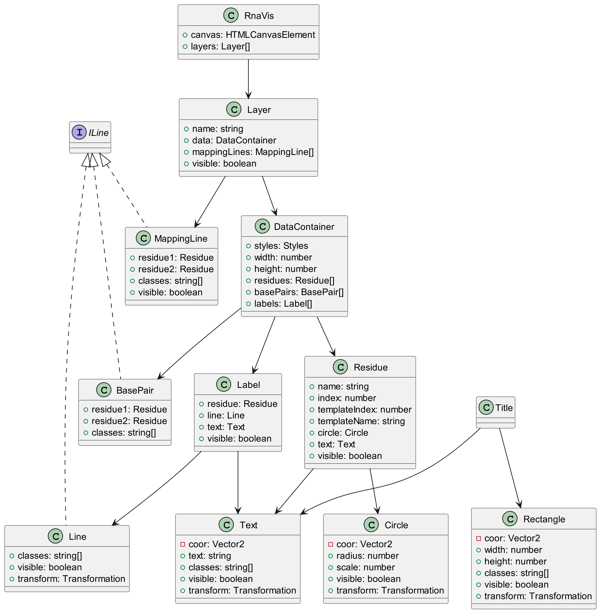
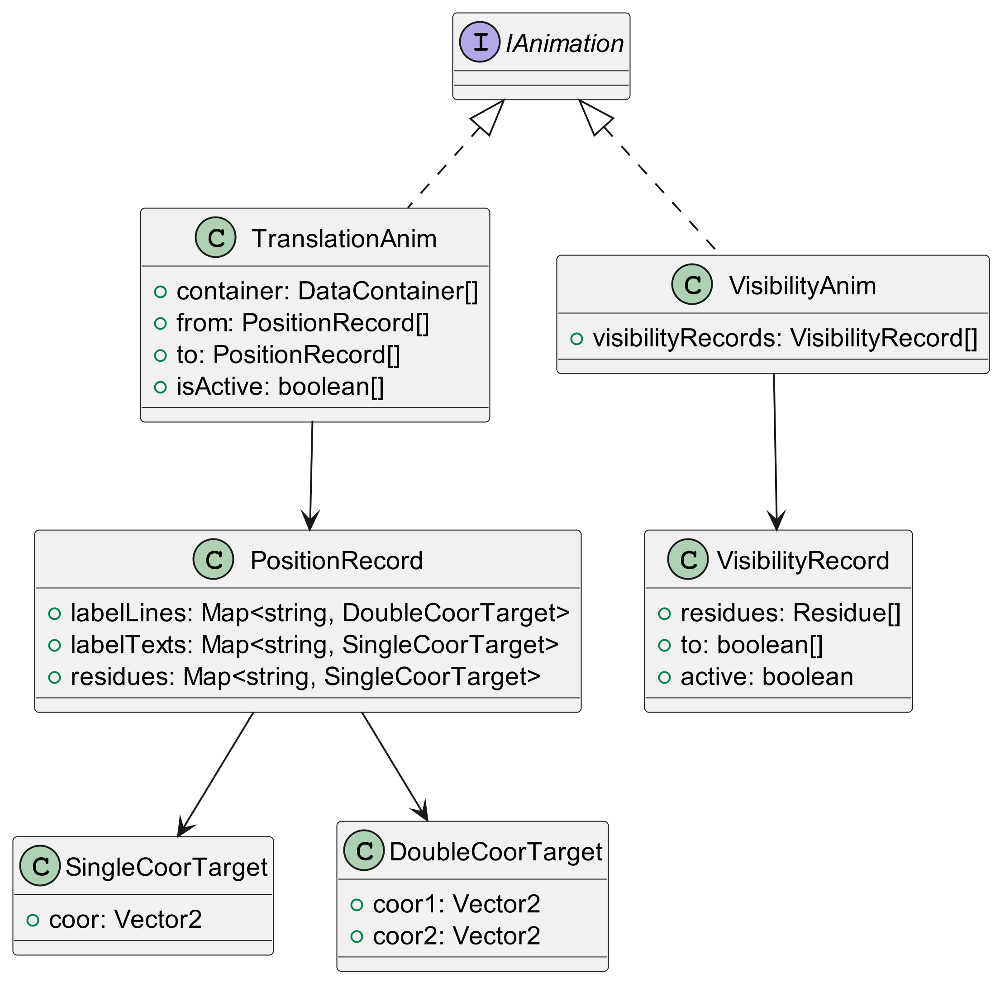
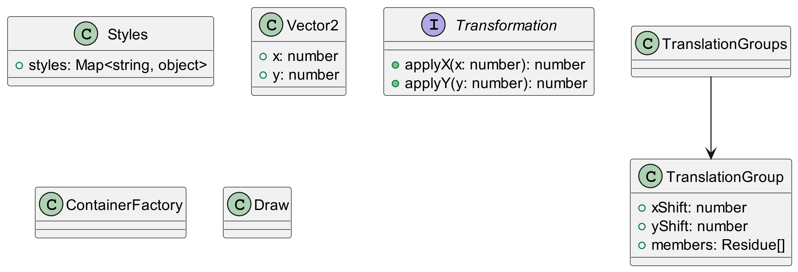

# RnaVis Documentation

 - [reference documentation](./docs/README.md)

## Class diagram

Following UML class diagrams gives you a notion of the library structure. For
clarity the diagrams doesn't show all relations a none of their methods. For
deeper understanding checkout [reference documentation](./docs/README.md).

